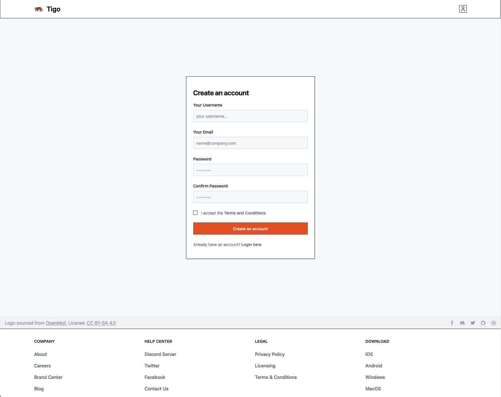

# About
Tigo. A work in progress local timetracking webapp using go and htmx

Features:

- Track your time
- The time is stored in a local sqlite file



# Starting the app:

0. setup your env file from the example.env!

1. watch for tailwind changes
```bash
just css
```

2. watch for go changes and run the server
```bash
just dev
```

3. watch for template changes in templ
```bash
just templ
```

You should now be able to view the hotreloading app on localhost:7331


# Building tailwind styles for templates
```bash
just css
```

# Rebuilding the ent db schema
```bash
just ent
```

# Running in dev mode & reload after making changes
```bash
just dev
```

# Running app
```bash
just run
```

